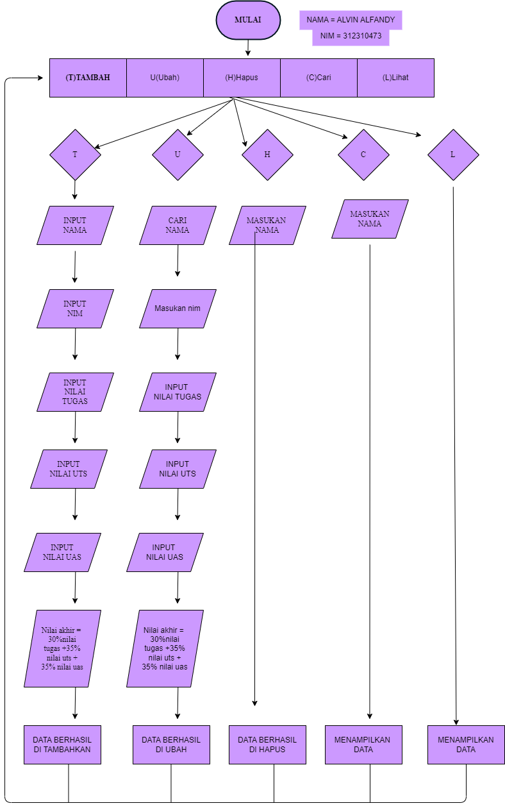

# tugas-pertemuan-ke-10
# dictionary
1. membuat kontak awal /
``` b = {'ari' : '085267888', 'dina' : 087677776} ```
2. menampilkan kontak ari /
``` print(b['ari'])```
3. menambhkan kontak riko /
``` b['riko']= 087888999```
4. mengubah kontak dina /
```b['dina]= '089555777```
5. menampilkan semua nama /
``` print(b.keys()) ```
6. menampilkan semua nomor /
``` print(b.values()) ```
7. menampilkan semua nama dan nomor /
``` print(b) ```
8. menghapus kontak dina /
``` del b['dina'] ``` /
berikut adalah tampilan program di visual studio: /
 \
dan ini adalah hasil program nya: \
 \

# tugas praktikum
program sederhana yang akan menampilkan daftar nilai mahasiswa \
flow chart: \
  \
1. membuat lopping agar program terus berjalan:
``` sh while True :
    c = input("\n(L)ihat, (T)ambah,(U)bah, (C)ari, (K)eluar): ")
```
2. membuat formatif if untuk memasukan pilihan , contoh pilihan (t): \
if (c.lower() == 't'):                                               
      ```  print('\nTambah Data Mahasiswa Baru')
        nama= input("Masukkan Nama\t\t: ")                                        
        nim= input("Masukkan NIM\t\t: ")                                         
        nilaiTugas= int(input("Masukkan Nilai Tugas\t: "))                              
        nilaiUts= int(input("Masukkan Nilai UTS\t: "))                                   
        nilaiUas= int(input("Masukkan Nilai UAS\t: "))                                    
        nilaiAkhir= (0.30 * nilaiTugas) + (0.35 * nilaiUts) + (0.35 * nilaiUas)              
        dataMhs[nama]= nim, nilaiTugas, nilaiUts, nilaiUas, nilaiAkhir                         
        print("\nData Berhasil Ditambahkan!")```
3. membuat percabangan elif untuk menjalankan pilihan yang lain
elif (c.lower() == 'u'):                                                                    
        print('\nMengedit Data Mahasiswa')
        nama = input("Masukkan Nama: ")                                                         
        if nama in dataMhs.keys():                              
            nim= input("Masukkan NIM Baru\t: ")                              
            nilaiTugas= int(input("Masukkan Nilai Tugas\t: "))                           
            nilaiUts= int(input("Masukkan Nilai UTS\t: "))                           
            nilaiUas= int(input("Masukkan Nilai UAS\t: "))                           
            nilaiAkhir= (0.30 * nilaiTugas) + (0.35 * nilaiUts) + (0.35 * nilaiUas)          
            dataMhs[nama] = nim, nilaiTugas, nilaiUts, nilaiUas, nilaiAkhir                      
            print("\nData Berhasil Di Update!")```
4. menggunakan else apabila salah memasukan pilihan 
else:
        print("Pilih menu yang tersedia: ")                                                   

ini adalah contoh output untuk (t): \
 \
ini adalah contoh output untuk (u): \
 \
output pilihan (c): \
 \
output pilihan (h): \
 \
output l atau lihat :\
